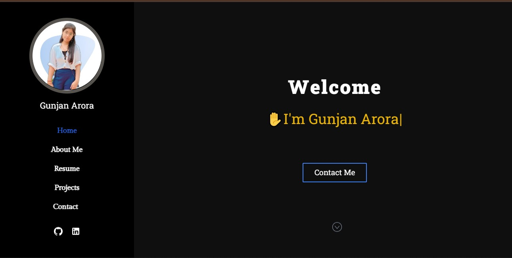

# 🌐 Personal Portfolio Website

This is my personal **developer portfolio website**, showcasing my background, skills, certifications, and projects. Built to reflect my personality and technical stack, it's a one-stop place to get to know me professionally.



---

## 🧑‍💻 About the Website

A fully responsive modern portfolio created using **React.js**, featuring:
- Clean sidebar navigation
- Smooth scroll and animations
- Sectioned layout: About Me, Resume, Projects, Contact
- CV download button
- GitHub & LinkedIn integration
- Tech stack progress bars
- Project cards with tech tags

---

## 🚀 Tech Stack

| Category     | Tech Used                          |
|--------------|------------------------------------|
| **Frontend** | React.js, Tailwind CSS             |
| **Design**   | Custom CSS, Icons (FontAwesome)    |
| **Hosting**  | GitHub Pages / Vercel (suggested)  |

---

## 🗂️ Sections Breakdown

### 🔹 **Welcome**
- Intro with typing animation
- Contact Me CTA button

### 🔹 **About Me**
- Brief intro with CV download option
- Tech stack highlights

### 🔹 **Resume**
- Certificates with download links
- Skill bars (React, AI, SQL, etc.)

### 🔹 **Projects**
- Project cards with stack tags
- Highlighted projects like:
  - `HotelBook`
  - `My-Shop`
  - `Money-Mind`
  - `Event-Planner`

### 🔹 **Contact**
- Basic contact form (Name, Email, Message)
- Social links (GitHub, LinkedIn)

---

## 🧪 How to Run Locally

```bash
git clone https://github.com/gun03-hub/Portfolio.git
cd Portfolio
npm install
npm start
```

The app will run on [http://localhost:3000](http://localhost:3000)

---

## 🎯 Future Improvements

- Add dark/light theme toggle
- Improve accessibility (ARIA labels, keyboard nav)
- Integrate email service (like EmailJS) for contact form

---

## 📌 Live Preview

🚀 [View Live Site](https://gunjanarora.netlify.app/#/) 
📄 [Download Resume (PDF)](src/assets/files/Resume.pdf)

---

## 🙋‍♀️ Author

**Gunjan Arora**  
🖥️ 2nd Yr CS Student @ University of Delhi  
🌐 [LinkedIn](https://www.linkedin.com/in/gunjan-arora-4248462a9/) | 💻 [GitHub](https://github.com/gun03-hub)

---

## 📄 License

This project is open-source and available under the [MIT License](LICENSE).

> Designed with ❤️ and deployed to show my work to the world.
